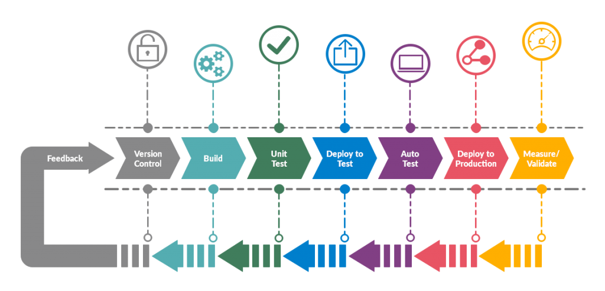
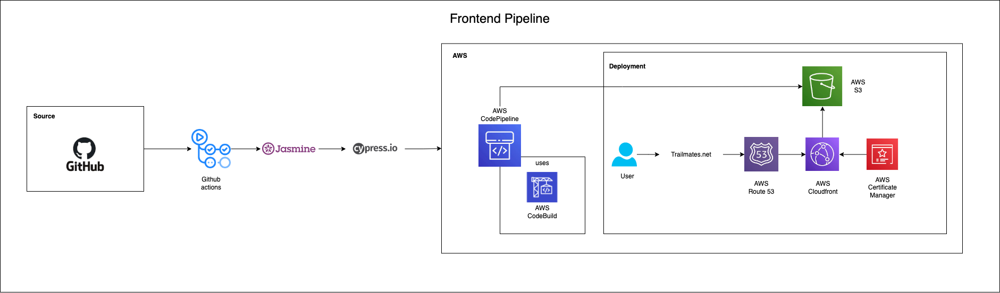
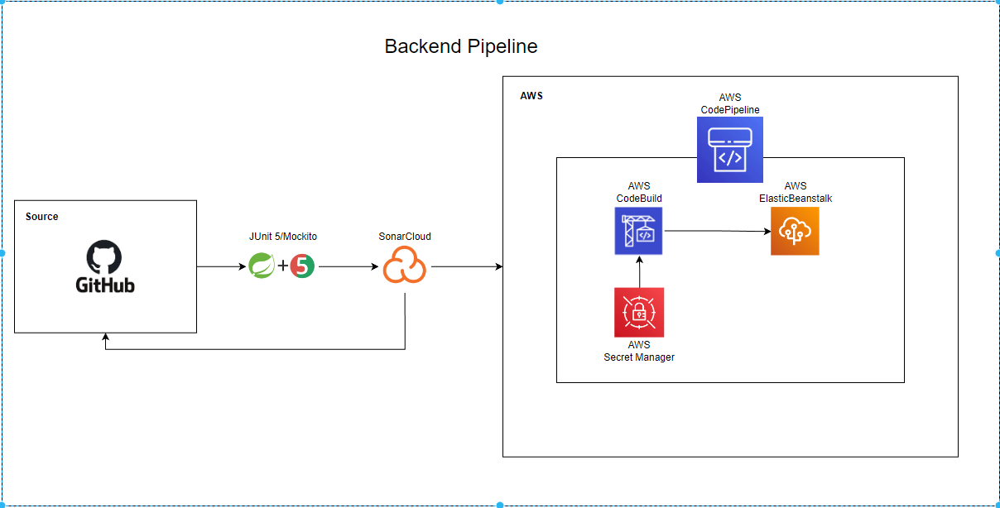

# Trailmates Devops Pipeline
---
## Index
1. [Pre-req](#pre-req)
2. [Frontend Pipeline](#trailmates-frontend-pipeline)
3. [Backend Pipeline](#trailmates-backend-pipeline)
---
## [Pre-req](#index)
### What is Dev Ops

Deveops is the marriage of Development and Operations. What does that mean? Does that mean Devops engineers develop and have opperation task?

The anwser to both of those questions is depends on the company and kinda because of anwser 1.

For similisty and for the context of our project devops was responsible for creating and maintaining the pipeline. I will go further in the next section of what a devop pipeline but for now think devops automates the task of creating a working enviorment for your code.

There are other responsibilites that devops mangae like monitoring and continous feedback but that is out of the scope of this readme.

### What is A Pipeline

A pipeline is a long pipe. But how does this play in when it comes to devops? 

A Deveop pipeline is a set of automated processes and tools that allows the building and deployment of code to production enviorment.

The pipe line part of it comes in on how this stucture looks.

> Devops Pipeline

### Phases of a pipeline

The phases of a devop pipline can be broken up into four main phases

1. Source - where code is hosted
2. Test - where code is validated
3. Build - where code is getting ready for production
4. Deploy - where code is hosted

---

## [Trailmates Frontend Pipeline](#index)

### Frontend Pipeline Tech Stack
- Source
    - Github
- Testing
    - Github Actions
        - Jasmine (Unit Testing)
        - Cypress (e2e Testing)
- Building
    - AWS CodePipeline
        - AWS CodeBuild (Build through buildspec.yml)
- Deployment
    - AWS CodePipeline
        - AWS CodeDeploy (takes the build and deploys on s3 bucket)
    - AWS S3 Bucket (Where build is hosted)
    - AWS Route 53 (routes dns to  bucket)
    - AWS Cloudfront  (findes closest sever and also determins ssl certificate)
    - AWS Certificate Manager (gives ssl certificate for dns)

### Runthrough of pipeline

1. The source code is located in github. 
2. On a push or pull request to main a github runner is activated to test the code with Jasmine and Cypress
3. AWS codebuild listens to any changes on the main branch if a change happen the pipeline starts.
4. AWS CodeBuild is then instructed to build the application according to the [buildspec.yml](buildspecs/frontend-buildspec.yml)
5. After building it is then deployed on a s3 bucket

### Hosting
1. Angular build is hosted on s3 bucket
2. User request trailmates.net
3. AWS route 53 connected to cloudfront with connects it with its ssl certificate and points to the s3 bucket

---

## [Trailmates Backend Pipeline](#index)

### Backend Pipeline Tech Stack

- Source
    - Github
- Testing
    - AWS CodePipeline
        - AWS CodeBuild
            - Maven (Testing is done when packaging .jar file)
- Building
    - AWS CodePipeline
        - AWS CodeBuild (Builds with buildspec.yml)
            - AWS Secret Manager (Holds application.properties values)
- Deploying
    - AWS Beanstalk (Host the .jar)

### Runthrough of pipeline

- The source code is located in 
-  AWS codebuild listens to any changes on the main branch if a change happen the pipeline starts.
-  AWS CodeBuild is then instructed to build the application according to the [buildspec.yml](buildspecs/backend-buildspec.yml)
    - Secret Manager stores the variables for aplication.properties and before .jar is packaged creates the file
- After building it is then deployed on a beanstalk
